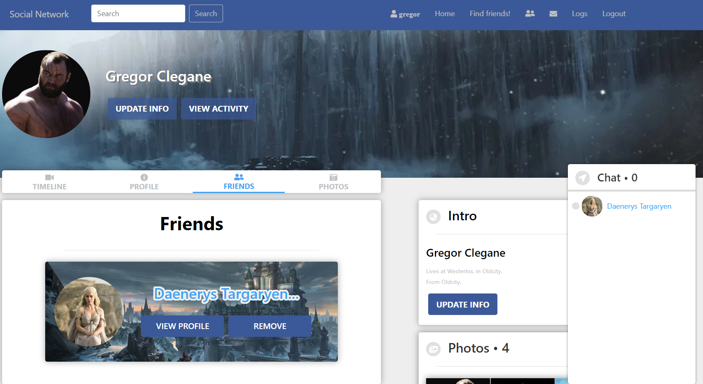
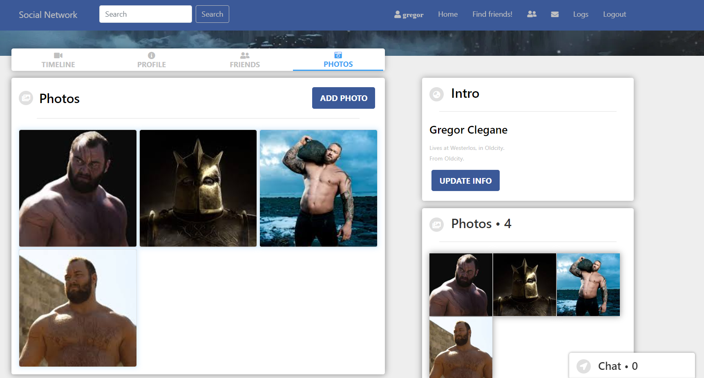

# Social-Network

Social-Network is a Stateful app built with [Spring Boot](http://spring.io/projects/spring-boot), [MySQL](https://www.mysql.com/) and [React](https://reactjs.org/).

Features:
- Routing
- User authentication: Register/Login/Logout
- 3 User Roles: Root, Admin and User
- Promoting/Demoting users to Admin/User
- Creating and deleting users
- Editing user profile
- Searching for friends
- Sending and accepting friend requests
- Removing friends from the friends list
- Adding and deleting photos
- Creating and deleting posts
- Creating and deleting comments
- Chat functionality: writing and receiving messages from your friends
- Logs history

The project is deployed on [Heroku](https://social-network-kl.herokuapp.com/).

**Admin Credentials:**
- username: john
- password: 1111

## Requirements

1. Java 11

2. In order to be able to save `Photos` you need to sign up to [Cloudinary](https://cloudinary.com/) and enter your credentials in the `application.properties` file of the Spring Boot app (`SocialNetwork\Server\src\main\resources\application.properties`)

## Start the app

### **Option 1 - Start the Client and the Server manually**

#### 1. Start the Client

To start the Client you need to enter the `SocialNetwork/Client` folder:

```bash
$ cd SocialNetwork/Client
```

Install all dependencies:

```bash
$ npm install
```

Run the app in the development mode:

```bash
$ npm start
```

Open [http://localhost:3000](http://localhost:3000) to view it in the browser.

#### 2. Start the Server

Go to the root directory of the Spring Boot app:

```bash
$ cd SocialNetwork/Server
```

Start the Server:

```bash
$ mvn spring-boot:run
```
The Server is running on port `8000`.


### **Option 2 - Start the application in Docker**

1. **Start the application**

Go to the project directory( `SocialNetwork/` ) and run:

```bash
$ docker-compose up -d
```

The front-end server will start on port `9090`. To open it enter in your browser:

```bash
$ http://localhost:9090
```
2. **Stop the application**

You can stop the containers with:

 ```bash 
 $ docker-compose down
 ```

## App screenshots

1. **Home Page**

 

2. **Friends Page**

 

3. **Photos Page**

 
